# VoltNest Architecture

This document describes the architecture and engineering boundaries of
VoltNest, a production-oriented multi-agent customer support platform.

VoltNest uses LLMs for language understanding, routing, and response
generation while keeping authentication, authorization, business rules,
persistence, and state-changing operations under deterministic
application control.

The central principle is:

> **LLMs interpret and reason. Application code authorizes and executes.**

---

## 1. System Overview

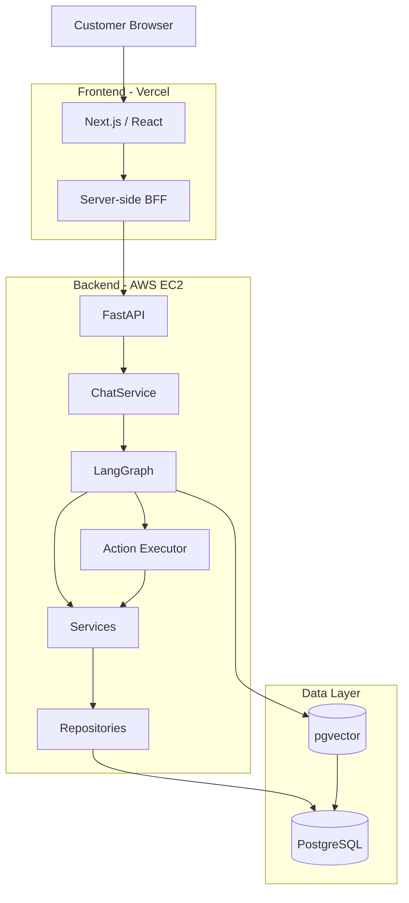

The browser communicates with the Next.js application.

Next.js acts as a Backend-for-Frontend (BFF), keeping the backend access
pattern and authentication handling outside direct browser control.

FastAPI exposes authenticated application APIs and delegates chat
execution to `ChatService`.

`ChatService` manages request reliability and invokes the LangGraph
support workflow.

PostgreSQL remains the source of truth for customer and commerce data.

---

## 2. Major Architectural Layers

VoltNest is intentionally divided into layers.

```text
Presentation
    ↓
API / Authentication
    ↓
Chat Reliability
    ↓
Agent Orchestration
    ↓
Tools / Actions
    ↓
Business Services
    ↓
Repositories
    ↓
PostgreSQL
```

### Presentation

The Next.js frontend handles:

- authentication UX
- conversations
- order views
- structured support cards
- confirmations
- response streaming
- safe retry UX

The frontend does not determine business eligibility.

### API

FastAPI handles:

- authentication
- authorization context
- request validation
- rate limiting
- request IDs
- health/readiness endpoints
- chat endpoints
- order endpoints
- conversation endpoints

### Chat Service

`ChatService` owns the reliable execution boundary around a customer
message.

It handles:

- request IDs
- request hashing
- duplicate detection
- idempotent replay
- in-progress request detection
- failed request recovery
- stale processing recovery
- conversation initialization
- persistence of successful responses

### LangGraph

LangGraph maintains conversational workflow state and coordinates the
specialized support capabilities.

### Services

Services own business rules.

Examples include:

- order cancellation eligibility
- cancellation execution
- return eligibility
- return creation
- order lookup
- payment/refund behavior

### Repositories

Repositories own persistence queries and database access patterns.

Agents never receive unrestricted repository or database access.

---

## 3. Request Lifecycle

A normal support request follows this path:

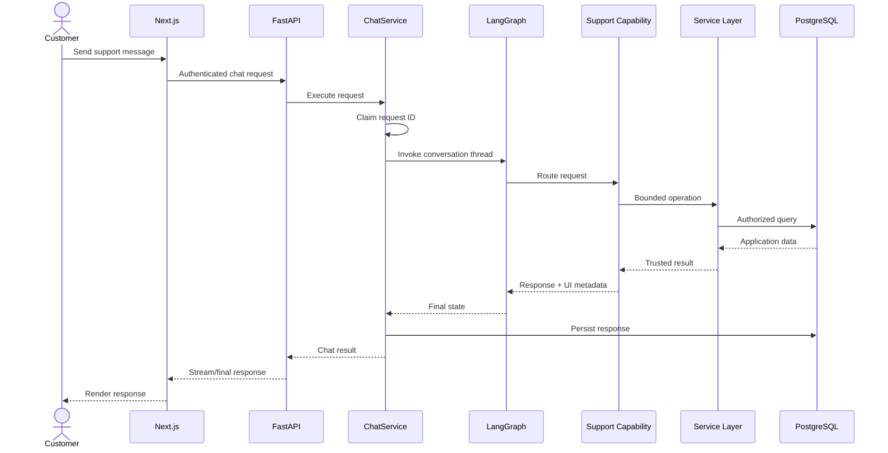

The exact internal path varies depending on the selected support
capability, but business state is never derived solely from generated
model text.

---

## 4. Agent Architecture

The supervisor chooses one of seven support capabilities.

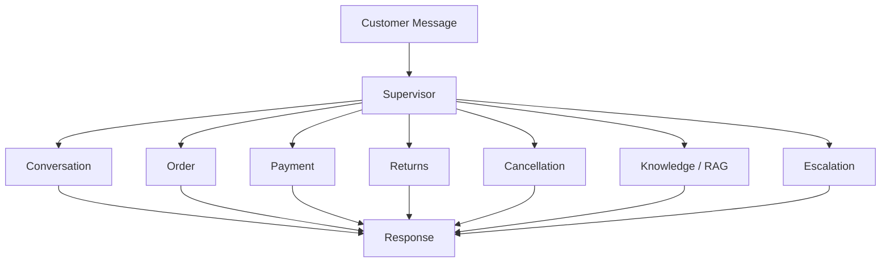

The supervisor uses structured output with these routes:

```text
conversation
order
payment
returns
cancellation
knowledge
escalation
```

Conversation history is included in routing decisions so contextual
follow-ups can remain attached to the correct workflow.

For example:

```text
Customer: Where is ORD-1003?
Assistant: The order is in transit.
Customer: When will it arrive?
```

The final message can still route to the order capability even though
the order number is not repeated.

---

## 5. LangGraph State

The support graph maintains shared state containing:

```text
messages
route
customer_id
confirmation_decision
pending_action
ui
```

`customer_id` is trusted application context.

It originates from authentication rather than from the LLM.

`pending_action` represents a proposed state-changing operation that
has not yet been authorized by the customer.

`ui` contains structured presentation metadata consumed by the
frontend.

---

## 6. Read-Only Operational Path

Customer-specific reads use a bounded path:

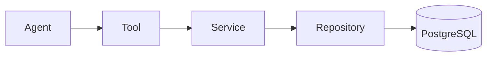

For example, an order-status request does not ask the LLM to invent an
order state.

Instead:

```text
Customer asks about order
        ↓
Agent identifies operation
        ↓
Tool receives trusted customer context
        ↓
OrderService
        ↓
ownership-aware repository query
        ↓
PostgreSQL
        ↓
trusted order data
        ↓
customer response
```

This separates language reasoning from application truth.

---

## 7. Knowledge / RAG Path

General VoltNest knowledge uses a separate retrieval path.

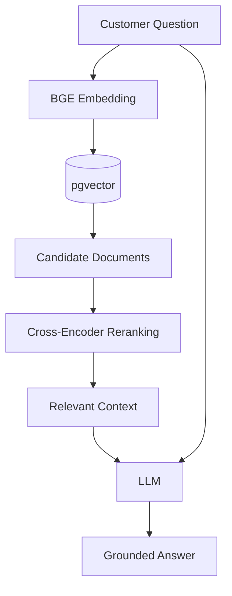

This path is appropriate for questions such as:

```text
What is the return policy?
How long is the warranty?
What is the shipping policy?
```

It is intentionally not used as the source of truth for live
customer-specific state.

For example:

```text
Where is my order?
```

must use operational data rather than support documents.

---

## 8. State-Changing Actions

State-changing operations use a stronger boundary than read-only
operations.

The current controlled action types include:

```text
create_return
cancel_order
```

The graph stores them as a `PendingAction`.

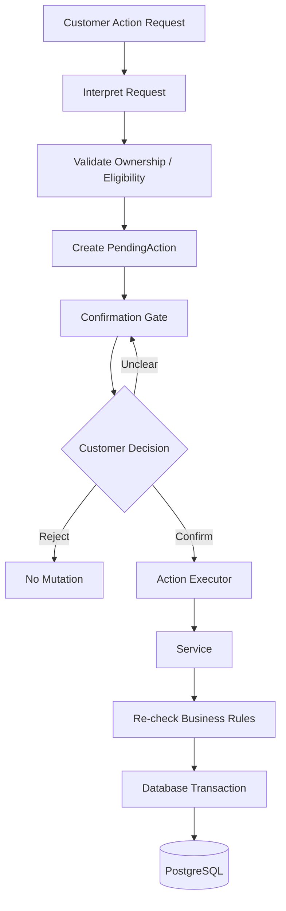

The important property is:

> Creating a pending action is not equivalent to executing it.

---

## 9. Cancellation Safety Boundary

Cancellation demonstrates this architecture clearly.

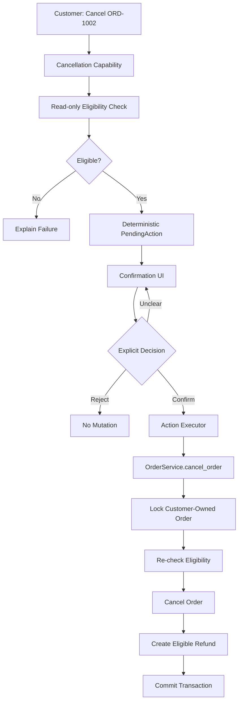

The cancellation LLM has access to the read-only eligibility
capability.

Once eligibility has been established, application code creates the
pending cancellation.

The LLM therefore does not control the transition from:

```text
eligible order
```

to:

```text
authorized database mutation
```

The customer must explicitly confirm first.

During actual execution, the service retrieves the customer-owned
order with a database row lock and re-checks cancellation eligibility.

This protects against the state changing between proposal and
execution.

---

## 10. Action Executor

`src/actions/executor.py` is the deterministic execution boundary for
pending actions.

Conceptually:

```text
PendingAction
     ↓
validate action data
     ↓
check idempotency record
     ↓
invoke business service
     ↓
perform mutation
     ↓
store idempotent result
     ↓
commit transaction
```

Both return creation and cancellation use an `action_id`.

The executor checks whether that action has already completed before
performing the operation.

If the same completed action is encountered again, the stored result
can be returned rather than repeating the mutation.

For cancellation, the following are committed atomically:

```text
order cancellation
optional refund creation
idempotency result
```

A failure rolls the transaction back.

---

## 11. Confirmation Gate

When graph state contains a `pending_action`, graph entry bypasses the
normal supervisor and enters the confirmation node.

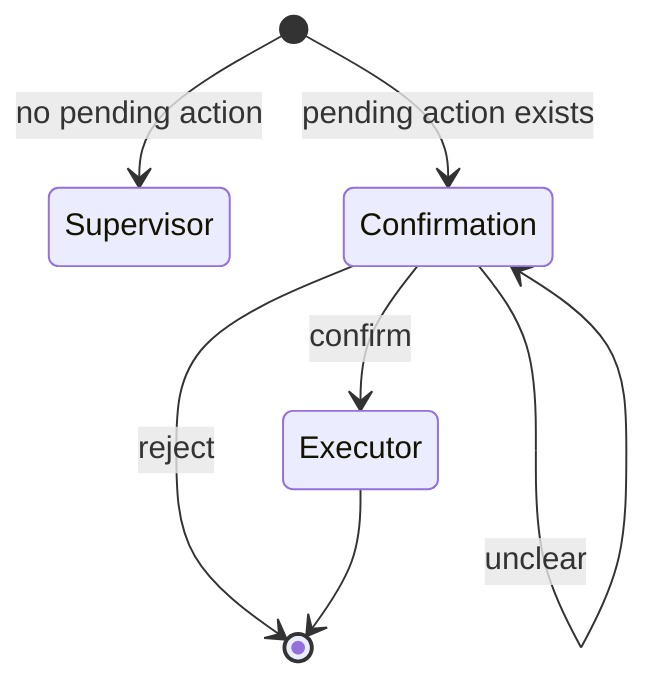

The confirmation classifier produces one of:

```text
confirm
reject
unclear
```

Behavior is deterministic after classification:

```text
reject
    → clear pending action
    → no execution

unclear
    → preserve pending action
    → ask again

confirm
    → action executor
```

Only the `confirm` branch can reach the action executor.

---

## 12. Idempotency

VoltNest has two related idempotency boundaries.

### Chat Request Idempotency

Each chat request has a unique request ID and request hash.

A request can be:

```text
processing
completed
failed
```

Completed requests can be replayed without re-running the workflow.

Reusing a request ID with different request content is rejected.

### Action Idempotency

State-changing operations have their own `action_id`.

The action executor stores successful results in an idempotency
record.

This protects the mutation boundary independently from chat-request
retries.

---

## 13. Failure Recovery

Chat execution handles transient failures explicitly.

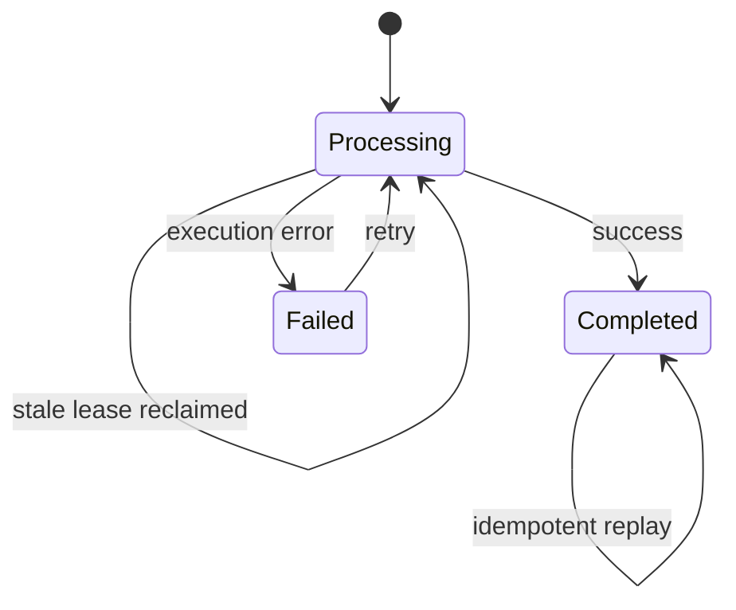

A processing lease allows abandoned/stale requests to be reclaimed.

The frontend reuses the original request ID when retrying a failed
request.

This prevents a customer retry from automatically becoming a new
logical operation.

---

## 14. Authentication and Authorization

Authentication establishes trusted customer identity before agent
execution.

```text
Browser
   ↓
Next.js session
   ↓
FastAPI authentication
   ↓
JWT verification
   ↓
trusted customer_id
   ↓
service/repository ownership checks
```

The customer does not provide an internal customer ID to an agent.

Operational tools receive identity from trusted application context.

Repository/service queries then scope resources to that authenticated
customer.

This protects resources such as:

- orders
- conversations
- returns
- cancellations
- payments

from cross-customer access.

---

## 15. Structured UI Boundary

The backend can return structured presentation metadata alongside
natural-language responses.

Supported UI types include:

```text
order_status
order_list
order_details
payment_status
confirmation
return_result
cancellation_result
support_ticket
```

The architecture is:

```text
Agent / deterministic workflow
          ↓
trusted facts
          ↓
structured UI payload
          ↓
frontend component
```

The frontend does not inspect arbitrary model prose to determine
whether a cancellation button, order card, or support-ticket card
should be rendered.

---

## 16. Streaming Architecture

VoltNest exposes:

```text
POST /chat
POST /chat/stream
```

The streaming endpoint runs chat execution in a worker and emits
incremental events to the client.

Conceptually:

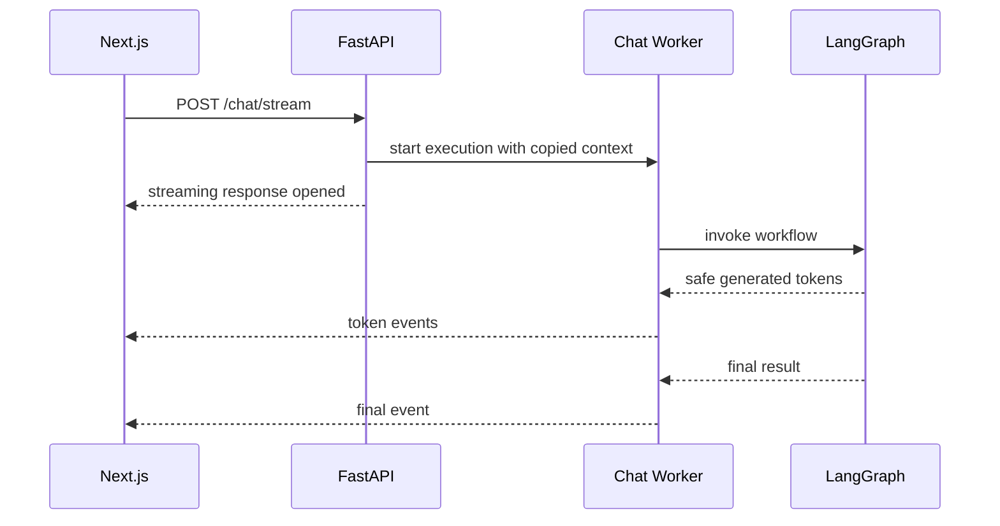

Request context is copied into the worker so request IDs and
conversation IDs remain available to structured logs during streamed
execution.

Only safe response-generation boundaries stream customer-visible
tokens. Internal tool reasoning is not exposed as a token stream.

---

## 17. Conversation Persistence

Conversation history is stored separately from LangGraph execution
state.

The conversation service supports:

- conversation creation
- customer ownership validation
- conversation listing
- message persistence
- structured UI persistence
- conversation deletion

LangGraph uses a PostgreSQL-backed checkpointer for workflow state,
while application conversation records support customer-facing
history.

---

## 18. Observability

The application uses structured logs across important boundaries.

Examples include:

```text
request.started
request.completed
chat.started
chat.completed
chat.failed
chat.retry_started
chat.stale_request_reclaimed
route.selected
agent.started
agent.completed
```

Logs can carry:

```text
request_id
conversation_id
route
duration_ms
operation metadata
```

The API also exposes:

```text
GET /health
GET /ready
```

`/health` verifies that the application process is alive.

`/ready` additionally checks PostgreSQL connectivity.

---

## 19. Testing Strategy

VoltNest separates deterministic correctness testing from
probabilistic agent evaluation.

### Deterministic tests

Used for behavior that should always be correct:

```text
authorization
transactions
row locking
return windows
payment/refund persistence
confirmation safety
cancellation proposal safety
```

### Agent evaluation

Used for model-dependent behavior such as routing.

The current supervisor evaluation contains **27 scenarios** and has
achieved:

> **27 / 27 scenarios passed — 100% on the current routing evaluation suite**

This is a scoped evaluation result, not a claim of universal routing
accuracy.

---

## 20. Confirmation Safety Tests

The destructive-action test suite explicitly verifies:

```text
Rejected action
    → 0 mutations

Unclear confirmation
    → 0 mutations

Pending but unconfirmed action
    → 0 mutations

Explicit confirmation
    → execution permitted
```

A separate cancellation regression test verifies:

```text
Cancel ORD-1002
       ↓
eligible cancellation
       ↓
PendingAction created
       ↓
confirmation UI created
       ↓
order still unchanged
```

Together these test the boundary between AI interpretation and
application mutation.

---

## 21. CI Pipeline

GitHub Actions validates backend and frontend changes.

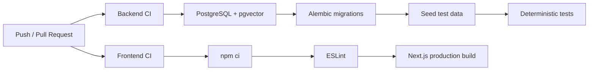

LLM-dependent evaluations are intentionally kept outside the normal
deterministic CI suite.

This prevents external model behavior or API availability from making
ordinary application CI nondeterministic.

---

## 22. Production Deployment

The current production topology is:

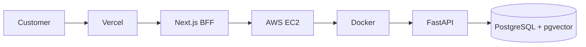

The frontend is deployed through Vercel.

The backend runs as a Dockerized FastAPI service on AWS EC2.

PostgreSQL with pgvector stores relational application data and vector
embeddings.

---

## 23. Why This Architecture?

A simpler implementation could expose database-changing tools directly
to a ReAct agent.

VoltNest deliberately avoids that architecture.

The model is useful for:

```text
language understanding
intent interpretation
routing
retrieval-assisted answering
response generation
```

Deterministic application code is better suited for:

```text
authentication
authorization
eligibility
transactions
locking
idempotency
confirmation enforcement
database mutation
```

The architecture uses each component where its properties are most
appropriate.

---

## 24. Core Engineering Invariants

VoltNest is designed around the following invariants:

1. **The LLM is not the source of truth for operational data.**
2. **Customer identity comes from authentication, not model output.**
3. **Agents do not receive unrestricted database access.**
4. **Business rules live in services, not prompts.**
5. **Repositories own persistence access.**
6. **Destructive actions require explicit confirmation.**
7. **Pending actions do not mutate application state.**
8. **Mutation eligibility is re-checked during execution.**
9. **State-changing operations are idempotent.**
10. **Retries must not silently duplicate logical operations.**
11. **Static knowledge and live operational data use different paths.**
12. **Structured application UI is not inferred from arbitrary LLM prose.**

---

## 25. Architectural Summary

The shortest description of VoltNest is:

```text
                    LLM / Agent Layer
                  understands and reasons
                           │
                           ▼
                   Controlled Capabilities
                           │
                           ▼
                   Deterministic Services
                           │
                           ▼
                Authorization + Transactions
                           │
                           ▼
                       PostgreSQL
```

For destructive operations:

```text
LLM interpretation
       ↓
read-only validation
       ↓
PendingAction
       ↓
explicit confirmation
       ↓
deterministic executor
       ↓
service re-validation
       ↓
locked transaction
       ↓
database mutation
```

That boundary is the central architectural idea behind VoltNest.